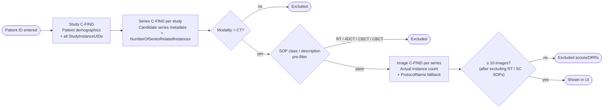

# CT Tilt Corrector

A Blazor Server application for querying CT series from an ARIA DICOM server, passing them through a tilt-correction algorithm entirely in memory, and returning the corrected series to ARIA. No DICOM files are written to disk at any point.

---

## Prerequisites

- .NET 8 SDK
- Windows machine (or service account) with network access to the Active Directory domain
- ARIA DICOM server accessible on the local clinical network
- Firewall rule allowing inbound TCP on the DICOM SCP port (default: **11112**)
- SimpleITK 2.2.x native libraries (included — no separate install)

---

## 1 — Configure appsettings.json

Edit `appsettings.json` before first run. The minimum required changes are the DICOM networking values and your AD settings.

```json
{
  "Kestrel": {
    "Endpoints": {
      "Http": {
        "Url": "http://0.0.0.0:5000"
      }
    }
  },
  "Dicom": {
    "LocalAeTitle": "CTTILTCORRECTOR",
    "LocalPort": 11112,
    "RemoteAeTitle": "ARIA_AE",
    "RemoteHost": "192.168.1.100",
    "RemotePort": 104,
    "MoveDestinationAeTitle": "CTTILTCORRECTOR",
    "ConnectionTimeoutSeconds": 30
  },
  "App": {
    "DatabasePath": "data/cttiltcorrector.db",
    "LogRootPath": "logs/corrections",
    "Domain": "YOURDOMAIN",
    "LdapServer": "192.168.1.10",
    "AllowedAdGroups": [
      "DOMAIN\\CT-TiltCorrector-Users"
    ]
  }
}
```

| Setting | Description |
|---|---|
| `Kestrel:Endpoints:Http:Url` | Address and port Kestrel listens on. HTTP only — internal network. |
| `Dicom:LocalAeTitle` | AE Title of this application. Must match what is registered in ARIA. |
| `Dicom:LocalPort` | Port ARIA pushes incoming images to (C-STORE SCP). |
| `Dicom:RemoteAeTitle` | ARIA's AE Title. |
| `Dicom:RemoteHost` | ARIA server IP or hostname. |
| `Dicom:RemotePort` | ARIA DICOM port (typically 104). |
| `Dicom:MoveDestinationAeTitle` | AE Title ARIA sends the C-MOVE response to. Usually the same as `LocalAeTitle`. |
| `App:DatabasePath` | Path to the SQLite database file. Created automatically on first run. |
| `App:LogRootPath` | Root directory for per-run log files. |
| `App:Domain` | Windows domain name prepended to usernames during LDAP authentication (e.g. `HOSPITAL`). |
| `App:LdapServer` | IP or hostname of the LDAP server used for AD group membership lookup. |
| `App:AllowedAdGroups` | AD groups whose members may access the app. User must be in at least one. Leave empty to allow any authenticated domain user (useful for development). |

---

## 2 — ARIA DICOM Node Registration

Register this application as a DICOM node in ARIA before first use:

| Field | Value |
|---|---|
| AE Title | Value of `Dicom:LocalAeTitle` |
| IP Address | IP of the server running this application |
| Port | Value of `Dicom:LocalPort` |

---

## 3 — Running

**Development:**
```bash
dotnet run
```
Navigate to `http://localhost:5000`.

**Production (Windows Service):**
```bash
dotnet publish -c Release -o ./publish
sc create CTTiltCorrector binPath="dotnet C:\path\to\publish\CTTiltCorrector.dll" start=auto
sc start CTTiltCorrector
```

Ensure the service account has write access to the folders defined in `App:DatabasePath` and `App:LogRootPath`.

---

## 4 — AD Group Testing

To allow all domain users during development, set `AllowedAdGroups` to an empty array and leave `Domain` and `LdapServer` empty:

```json
"App": {
  "Domain": "",
  "LdapServer": "",
  "AllowedAdGroups": []
}
```

This grants access to any authenticated domain account without performing LDAP group checks. Populate all three fields before going to production.

---

## Architecture

### Overview

CTTiltCorrectorWebApp is an ASP.NET Core 8.0 Blazor Server application that corrects CT scanner gantry tilt artifacts in DICOM imaging series. The application connects to ARIA, retrieves a CT series, mathematically resamples the 3D volume into standard axial orientation using SimpleITK, and sends the corrected slices back to ARIA — all driven through a browser-based UI.

**Technology stack:** Blazor Server (interactive server-side UI), Entity Framework Core with SQLite (database), fo-dicom (DICOM networking), SimpleITK (image resampling), MudBlazor (UI components), Active Directory (authentication).

---

### Startup & Configuration

The application entry point registers every service into the .NET dependency injection container and configures the middleware pipeline. The key things it sets up are:

- **Cookie authentication** with an 8-hour sliding expiration. Users log in once and remain authenticated until they are idle for 8 hours.
- **Authorization policy** that requires all users to be authenticated. Optionally, users must also belong to specific Active Directory groups configured in `appsettings.json`. If no groups are configured, any authenticated user is allowed.
- **EF Core with SQLite** pointed at a local database file. The schema is automatically created on first startup if it does not already exist.
- **Three background services** that start immediately when the app launches and run for its entire lifetime: the DICOM SCP listener (receives incoming slices), the correction job processor (drains the job queue), and the in-memory DICOM store (shared buffer between the two).

---

### Data Layer

The database context manages a single table — **CorrectionRuns** — which records every correction job that has ever been submitted. Each row stores the patient MRN, the DICOM series UID, who submitted the job and when, the path to the job's log file, and a status field that progresses from `Running` through to `Completed`, `Failed`, or `Cancelled`. The table is indexed on patient ID and execution date to support the history page's filtering and sorting queries.

---

### Authentication

**AdAuthService** handles validating a username and password against Active Directory using LDAP. When a user submits the login form, this service opens a connection to the configured LDAP server and attempts to authenticate the credentials. If valid, it checks that the account is enabled, retrieves all the Active Directory groups the user belongs to, and checks whether any match the configured allowed groups.

If Active Directory is not configured at all, the service operates in a permissive mode that accepts any non-empty username and password — useful during local development.

On successful login, a browser authentication cookie is issued containing the username and the user's AD group memberships as claims. These claims are what the Blazor `[Authorize]` attributes check throughout the application.

---

### DICOM Infrastructure

**DicomStoreScp** is a hosted service that runs a DICOM C-STORE SCP on the configured local port. This means the application acts as a DICOM server that other systems can push images to. In normal operation, ARIA pushes CT slices here in response to a C-MOVE request that the application issues. For every incoming slice, the handler checks whether the series UID has been pre-registered as expected. If it has, the slice is cloned and stored. If not — meaning an unsolicited push arrived — the slice is silently dropped. This guard ensures the memory store is never polluted by unexpected traffic from other sources on the network.

**InMemoryDicomStore** is a singleton that acts as the shared in-memory buffer between the SCP listener and the correction pipeline. Slices flow in from the network and are later drained out by the correction service. Before issuing a C-MOVE, the correction service calls `Expect()` to register the series UID. The SCP listener uses this registration as the gate for accepting slices. Once delivery is complete, `Drain()` atomically removes and returns all buffered slices sorted by instance number. On error or cancellation, `Discard()` clears the buffer.

**DicomQueryService** is a scoped service responsible for issuing DICOM queries to ARIA. It has three responsibilities:

- **Series discovery** runs a multi-tier C-FIND pipeline. First it queries at the study level to get patient demographics and study UIDs, then at the series level for each study. Results are filtered: only CT modality series pass through, and a hard-coded exclusion list blocks RT planning objects, dose reports, registrations, DRRs, secondary captures, and presentation states. For each remaining series, an image-level C-FIND retrieves the actual instance count and, if `SeriesDescription` is absent, falls back to `ProtocolName` or `ImageComments`. Series with fewer than 10 images are excluded, as are series whose descriptions contain keywords like `4DCT`, `RESPIRATORY`, or `CBCT`.
- **Series retrieval** issues a C-MOVE request to ARIA, instructing it to push the specified series to the local SCP listener.
- **Conflict checking** performs a series-level C-FIND to retrieve the series numbers and descriptions already present in a study — used later to avoid sending back a series that would clash with an existing one.

---

### Job Queue & Background Processing

**CorrectionJobQueue** is a singleton that holds a bounded channel of correction jobs with a maximum capacity of 64. It also maintains a set of currently active series UIDs to prevent duplicate submissions. When a user clicks "Correct Tilt", the job is written into the channel. If the same series UID is already active — either queued or currently processing — the submission is rejected. When a job finishes, the series UID is removed from the active set and a `JobCompleted` event fires, which the Search page subscribes to in order to re-enable buttons. The bounded channel provides natural backpressure: if 64 jobs are already queued, new submissions will wait until space opens up.

**CorrectionJobProcessor** is a `BackgroundService` that runs a continuous loop for the lifetime of the application. It blocks waiting on the queue channel. When a job becomes available it dequeues it, creates a fresh dependency injection scope (so the scoped `CorrectionService` and `DbContext` are isolated to this job), notifies `MonitorState` that a job has started, runs the full correction pipeline, then marks the job complete and loops back to wait for the next one.

Jobs are processed one at a time. This is intentional — ITK resampling is CPU and memory intensive, and running jobs concurrently would contend for those resources. If an unhandled exception escapes the correction service, it is caught here, reported to the user's Monitor channel, and the processor continues running to handle subsequent jobs. The application shutdown cancellation token is passed through, so a job mid-flight receives a cancellation signal and can exit cleanly.

---

### Correction Pipeline

**CorrectionService** is the main orchestration class. Its `RunAsync` method drives the end-to-end workflow for a single job, reporting progress at each stage to the user's Monitor channel in real time.

- **Database record creation.** A `CorrectionRun` row is inserted with status `Running` and a log file path constructed from the current timestamp and patient ID.
- **Series registration.** Calls `Expect()` on `InMemoryDicomStore` so the SCP listener knows to accept incoming slices for this series.
- **C-MOVE trigger.** Sends a C-MOVE request to ARIA, which begins streaming the series slices to the local SCP listener asynchronously.
- **Delivery wait.** Polls the in-memory store's slice count until delivery is considered complete. If the expected slice count was known from the image-level C-FIND, it waits until that exact count is reached then holds for a further two seconds to catch stragglers. If the count was not known, it uses a stability-based approach: once the count stops changing for 2.5 seconds, delivery is considered complete. Overall timeout is 5 minutes.
- **Slice drain.** Atomically removes all buffered slices sorted by instance number.
- **Tilt correction.** Passes the sorted slices to `ITiltCorrector.CorrectAsync()`. This is the CPU-heavy resampling step.
- **Conflict resolution.** Before sending anything back, queries ARIA for the series numbers and descriptions already present in the study. If the proposed series number (reference + 1000) or description (original + `-Rsmpld`) already exists, it increments and retries until a unique combination is found.
- **Send to ARIA.** Opens a DICOM association to ARIA and sends all corrected slices via C-STORE. Retries up to three times with five-second delays between attempts.
- **Finalisation.** Updates the database record to `Completed` or `Failed`, flushes the log file to disk, and notifies `MonitorState` that the job is finished.

---

### Tilt Correction Algorithm

**TiltCorrector** is the top-level correction entry point. It loads and validates the input slices, checks whether the series is already in standard orientation (in which case no correction is needed and the input is returned unchanged), determines the output voxel spacing, decides the output patient position, runs the ITK resampling, and builds the output DICOM datasets.

**DicomSeriesLoader** parses the raw DICOM datasets into a structured list ready for the algorithm. It filters out any slice missing an image position or orientation, validates that all slices share the same series UID and the same image orientation, projects each slice's position onto the slice normal to produce a sortable scalar position, sorts slices in ascending Z order, and validates that spacing between slices is uniform throughout the series.

**SimpleItkResampler** is where the gantry tilt is mathematically removed. It reads the coordinate geometry from the first slice — the image position, orientation direction cosines, and pixel spacing. From the orientation cosines it builds a 3×3 direction matrix that encodes the gantry tilt angle. It applies the DICOM rescale slope and intercept to convert all pixel values to Hounsfield Units, then loads the entire volume into an ITK image with that tilted geometry. It computes the axis-aligned bounding box of the tilted volume by evaluating all 8 corners in patient coordinate space and finding the smallest box aligned with the LPS axes that contains them all — this determines the origin and size of the output grid. Finally it runs ITK's resampling filter with an identity direction matrix (standard axial orientation) and linear interpolation. Voxels in the output grid that fall outside the original volume are filled with the value of a corner voxel, approximately −1024 HU (air).

**DicomSeriesWriter** converts the resampled ITK volume back into a list of DICOM datasets. For each axial slice it extracts the pixel plane, applies the inverse rescale to convert Hounsfield Units back to stored pixel values, finds the closest reference slice by position, copies all non-geometry DICOM tags from that reference slice (preserving patient demographics, study metadata, acquisition parameters), then writes the corrected geometry — the identity image orientation, the computed image position for that slice, and the pixel spacing. Each output slice gets a unique SOP instance UID; all slices share a new series instance UID. The series number and description are assigned initial values here, and the conflict-resolution step may adjust them before the slices are sent.

**Supporting utilities:**

| Component | Role |
|---|---|
| OrientationHelper | Parses image orientation strings and computes slice normals via cross product |
| SliceSpacingCalculator | Resolves voxel spacing: `SliceThickness` tag → median IPP gap → 1.0 mm default |
| VolumeGeometry | Computes axis-aligned bounding box from 8 volume corners in patient space |
| DicomTagCopier | Copies all tags from a reference slice, skipping geometry-defining tags |
| DicomLoadValidators | Validates single series UID, uniform orientation, uniform spacing, consistent patient position |

---

### Live Monitoring

**MonitorState** is a singleton that maintains a separate live log channel for each user. When the correction pipeline reports a progress message, it is appended to that user's channel buffer (capped at 500 lines) and all subscribers are notified. The Monitor Blazor component subscribes to the user's channel when it mounts and unsubscribes on dispose. Every notification triggers a Blazor re-render, updating the terminal display in the browser in near-real time. The channel also tracks whether a job is currently running and the human-readable job description, which drives the status indicator at the top of the Monitor page.

---

### UI Pages

**Search** is the main user entry point. The user enters a patient MRN and clicks Search, which fires the multi-tier DICOM C-FIND query. Results are shown in a table with one row per CT series. The Correct Tilt button is disabled if that series is already queued or processing. Clicking it submits the job and navigates the user to the Monitor page. The page subscribes to the queue's `JobCompleted` event so that when a job finishes, the button for that series re-enables without requiring a manual refresh.

**Monitor** displays the live log stream for the current user's active job. The terminal auto-scrolls as new lines arrive. Lines are colour-coded: errors and failures in red, success messages in green, warnings in yellow, geometry-related messages in blue, and general output in grey. A status indicator at the top shows whether a job is running, completed, failed, or idle.

**History** shows a paginated table of all past correction runs from the database, ordered newest first. Users can filter by patient MRN with a short debounce delay. Status is shown as a coloured chip. Each completed row has a View Log button that opens a modal showing the full log file for that run.

---

### End-to-End Data Flow

```
Browser (Search page)
  └─► DicomQueryService.FindAsync()
        └─► C-FIND to ARIA (study → series → image level, filtered)
              └─► Returns enriched series list to UI

User clicks "Correct Tilt"
  └─► CorrectionJobQueue.EnqueueAsync()
        └─► Job written into bounded channel (capacity 64)
              └─► User navigated to Monitor page

CorrectionJobProcessor (background thread, always running)
  └─► Blocks on channel until job available
  └─► CorrectionService.RunAsync()
        ├─► DB: INSERT CorrectionRun (Status = Running)
        ├─► InMemoryDicomStore.Expect(seriesUid)
        ├─► DicomQueryService.MoveSeriesAsync()
        │     └─► C-MOVE request to ARIA
        │           └─► ARIA begins streaming slices via C-STORE
        │                 └─► DicomStoreScp receives each slice
        │                       └─► InMemoryDicomStore.Add()
        ├─► WaitForStableDeliveryAsync()
        │     └─► Polls slice count every 500ms until stable or expected count reached
        ├─► InMemoryDicomStore.Drain()
        │     └─► Returns all slices sorted by instance number
        ├─► TiltCorrector.CorrectAsync()
        │     ├─► DicomSeriesLoader — parse, validate, sort
        │     ├─► SimpleItkResampler — build tilted ITK volume, resample to identity orientation
        │     └─► DicomSeriesWriter — convert resampled volume back to DICOM datasets
        ├─► ResolveSeriesConflictsAsync()
        │     └─► C-FIND to ARIA, increment SeriesNumber/Description until unique
        ├─► SendToAriaAsync() (up to 3 retries)
        │     └─► C-STORE SCU sends all corrected slices to ARIA
        └─► DB: UPDATE CorrectionRun (Status = Completed / Failed)
              └─► Log file flushed to disk

MonitorState (singleton, throughout the above)
  └─► Per-user UserMonitorChannel
        └─► IProgress<string> callbacks append lines to buffer
              └─► Subscribers notified on each line
                    └─► Monitor.razor re-renders terminal in browser
```

---

### Job Pipeline

```mermaid
flowchart TD
    A([User clicks Correct Tilt on Search page]) --> B

    B["CorrectionJobQueue
    Channel&lt;QueuedJob&gt; — capacity 64
    Deduplicates by SeriesInstanceUID"]

    B -->|one job at a time| C

    C["CorrectionJobProcessor
    BackgroundService
    Creates a DI scope per job"]

    C --> D["store.Expect(seriesUid)
    Open the store for this series only"]

    D --> E["C-MOVE SCU
    Request series from ARIA"]

    E -->|ARIA pushes slices via C-STORE| F

    F["DicomStoreScp
    C-STORE SCP — HostedService
    No disk writes"]

    F --> G["InMemoryDicomStore
    Accumulate datasets in memory
    Slices for other series are dropped"]

    G --> H{Wait strategy}

    H -->|"NumberOfSeriesRelatedInstances > 0"| I["Wait for exact count
    polling every 1 s"]

    H -->|"Count unavailable"| J["Stability window
    wait 5 s with no change"]

    I --> K["store.Drain()
    Remove + sort by Instance Number"]
    J --> K

    K --> L["ITiltCorrector.CorrectAsync()
    Runs on thread pool"]

    subgraph "Correction Algorithm (TiltCorrector)"
        L --> L1["DicomSeriesLoader.Load()
        Validate series, sort by IPP-Z,
        compute tilt normal"]
        L1 --> L2{Already identity IOP?}
        L2 -->|"IOP = 1\0\0\0\1\0"| L3([Return slices unchanged])
        L2 -->|tilted| L4["SliceSpacingCalculator.Compute()
        Use SliceThickness tag
        Fallback: median IPP gap"]
        L4 --> L5["SimpleItkResampler.Resample()
        Build ITK volume with tilt direction
        Compute AABB via VolumeGeometry
        Resample to identity orientation
        Linear interpolation"]
        L5 --> L6["DicomSeriesWriter.BuildDatasets()
        New SeriesInstanceUID + SOPInstanceUIDs
        Identity IOP, corrected IPP per slice
        Copy non-geometry tags from nearest ref slice
        Inverse rescale → stored pixel values"]
        L6 --> L7([Return corrected datasets])
    end

    L3 --> M
    L7 --> M

    M["C-STORE SCU
    Upload corrected series to ARIA
    Up to 3 retries with 5 s delay"]

    M --> N[("SQLite
    Persist CorrectionRun
    status / log path")]

    M --> O([Job complete
    Monitor page shows final status])
```



---

### ARIA Query Pipeline (Search Page)

Each patient search runs a multi-tier filter chain to surface only diagnostic CT series, suppressing RT objects, scouts, DRRs, 4DCT, and CBCT.



---

### Concurrency

Multiple users can search (C-FIND) simultaneously without issue. Correction jobs are queued and processed strictly one at a time — the processor does not dequeue the next job until the current one has fully completed including upload.

The `InMemoryDicomStore` only accepts slices for the currently active series (registered via `Expect()`); any unexpected slices are silently dropped and logged as warnings. This prevents a queued job's C-MOVE response from contaminating the store while a prior job is still running.

Upload failures retry up to 3 times with a 5-second delay before the job is marked Failed.
